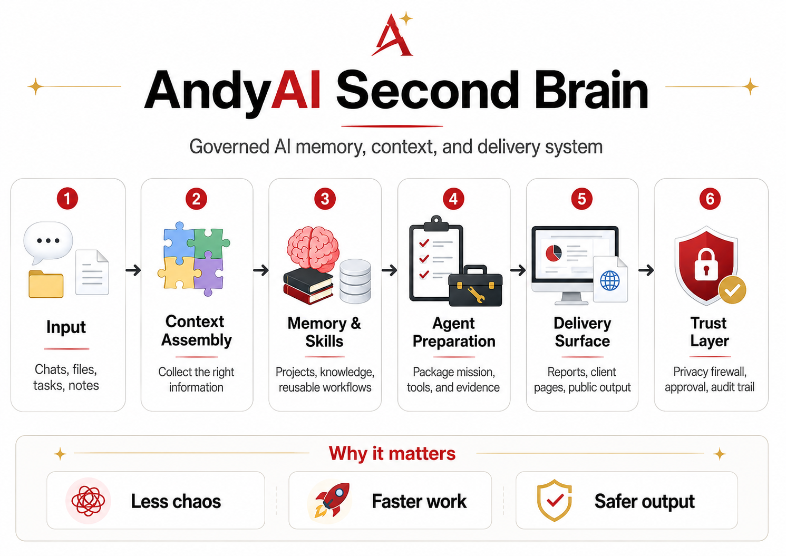
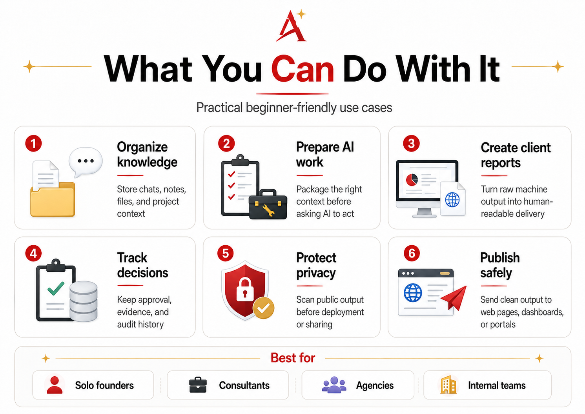
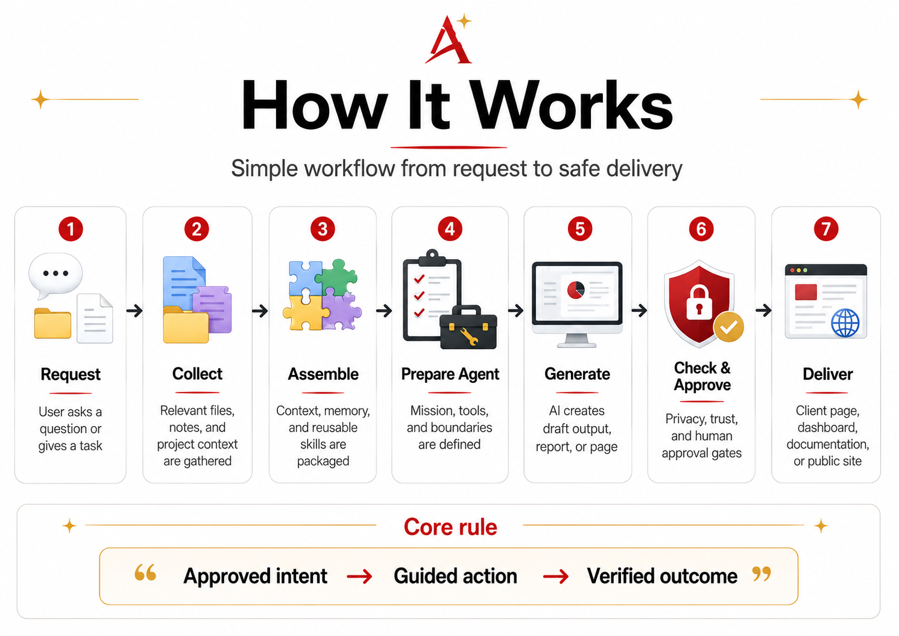
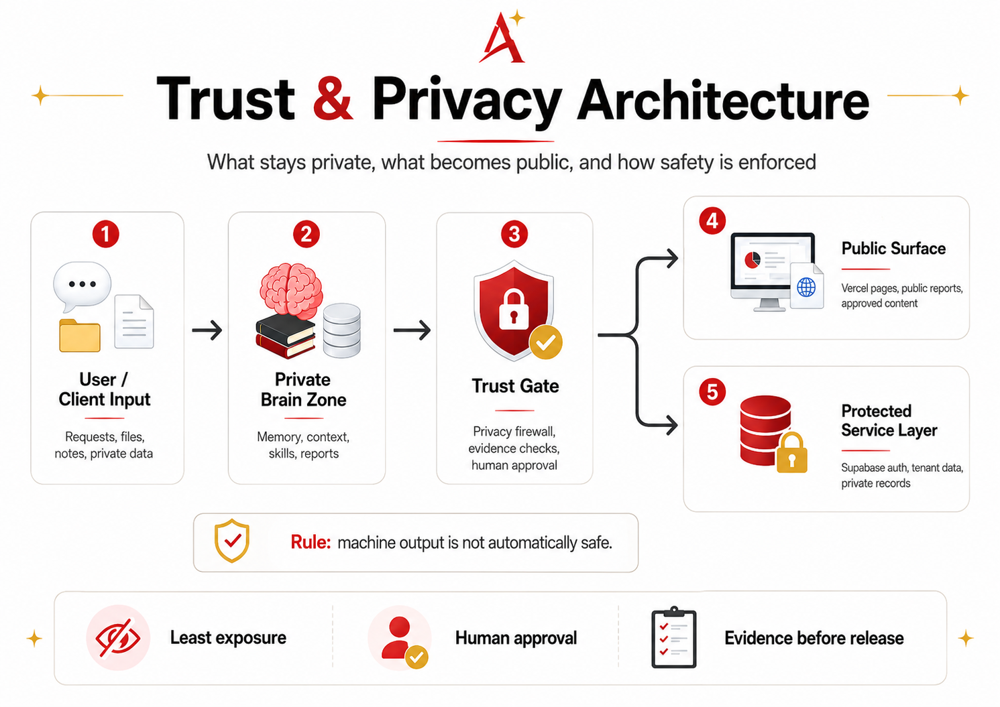
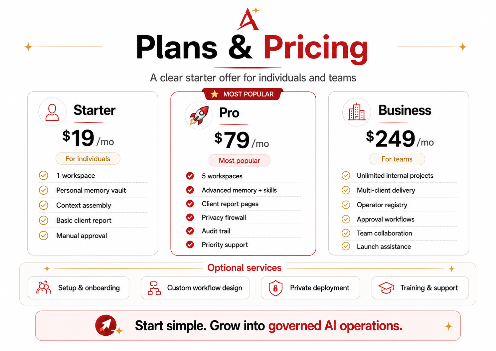

# 🅰️ AndyAI Second Brain

**Governed AI memory, context, and delivery system.**

AndyAI Second Brain helps people and teams turn scattered chats, files, notes, decisions and AI output into organized knowledge, trusted workflows and safe delivery surfaces.

It is not just another AI chat.

It is a practical operating layer for remembering project context, preparing better AI work, creating client-ready reports, protecting privacy before publishing, keeping evidence and approval trails, and moving from raw machine output to human-readable delivery.

  

## Why it matters

Most AI work becomes chaotic very quickly.

Chats get lost. Files are disconnected. Decisions are not recorded. Outputs become drafts without delivery. Private information can accidentally move into public places.

AndyAI Second Brain introduces structure:

- **less chaos**
- **faster work**
- **safer output**
- **clearer context**
- **better client delivery**
- **privacy and human approval before release**

## What can you do with it?

  

You can use AndyAI Second Brain to organize knowledge, prepare AI work, create client reports, track decisions, protect privacy and publish safely.

## How it works

  

The basic workflow is:

1. **Request** — the user asks a question or gives a task.
2. **Collect** — relevant files, notes and project context are gathered.
3. **Assemble** — context, memory and reusable skills are packaged.
4. **Prepare Agent** — mission, tools and boundaries are defined.
5. **Generate** — AI creates a draft output, report or page.
6. **Check & Approve** — privacy, trust and human approval gates are applied.
7. **Deliver** — the result becomes a client page, dashboard, document or public site.

> **Approved intent → Guided action → Verified outcome**

## Trust & Privacy Architecture

  

Privacy is not an afterthought.

AndyAI Second Brain separates private input, internal memory, trust gates, public pages and protected service layers.

> **Machine output is not automatically safe.**  
> Safe output is machine output that passed privacy, trust and human approval gates.

> **Trust is not a feature. Trust is the product boundary.**

## Plans & Pricing

  

### Starter — $19/mo

For individuals who want to organize AI work and personal project memory.

Includes 1 workspace, personal memory vault, context assembly, basic client report and manual approval.

### Pro — $79/mo

For consultants, creators and advanced operators.

Includes 5 workspaces, advanced memory and skills, client report pages, privacy firewall, audit trail and priority support.

### Business — $249/mo

For teams, agencies and small businesses.

Includes unlimited internal projects, multi-client delivery, operator registry, approval workflows, team collaboration and launch assistance.

## Documentation

- [Beginner Quickstart](./docs/tutorials/01-beginner-quickstart.md)
- [What is AndyAI Second Brain?](./docs/beginners/WHAT_IS_ANDYAI_SECOND_BRAIN.md)
- [Privacy and Trust](./docs/trust/PRIVACY_AND_TRUST.md)
- [Plans and Pricing](./docs/pricing/PLANS_AND_PRICING.md)
- [First Tutorial Scaffold](./docs/tutorials/FIRST_TUTORIAL_SCAFFOLD.md)
- [Front Page Copy Deck](./docs/marketing/FRONT_PAGE_COPY_DECK.md)

## Public demo routes

- `https://brain.andyai.ai`
- `https://brain.andyai.ai/client/`
- `https://brain.andyai.ai/client-portal/`
- `https://brain.andyai.ai/health/`
- `https://brain.andyai.ai/trust/`
- `https://brain.andyai.ai/faq/`

Start simple. Grow into governed AI operations.
