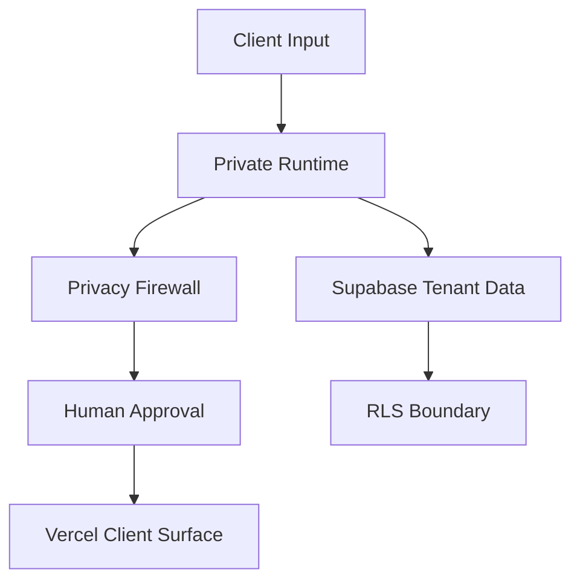

# SaaS Privacy Boundary Diagram

```mermaid
flowchart TD
  A[Client Input] --> B[Private Runtime]
  B --> C[Supabase Tenant Data]
  B --> D[Privacy Firewall]
  D --> E[Human Approval]
  E --> F[Vercel Client Surface]
  C --> G[RLS Boundary]
```
